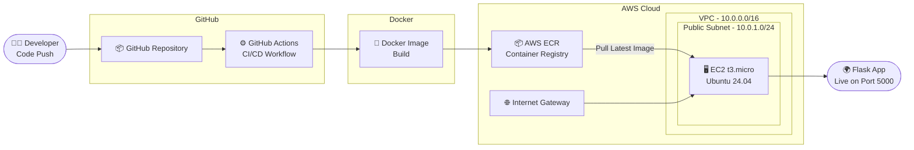

# 🚀 DevOps CI/CD Pipeline Project

<div align="center">


**Fully automated CI/CD pipeline that builds, containerizes, and deploys a Flask app to AWS EC2 — triggered on every GitHub push. Zero manual steps.**

</div>

---

## 📌 Overview

This project demonstrates a **production-style DevOps pipeline** built from scratch. Every `git push` to the `main` branch triggers an automated workflow that:

- Builds a Docker image of a Python Flask application
- Pushes the image to **AWS ECR** (Elastic Container Registry)
- Provisions infrastructure on **AWS** using **Terraform**
- Deploys the latest container to an **EC2** instance automatically

---

## 🏗️ Architecture



---

## 🛠️ Tech Stack

| Layer | Technology |
|---|---|
| **Application** | Python 3.11 + Flask |
| **Containerization** | Docker (python:3.11-slim base) |
| **Container Registry** | AWS ECR |
| **Infrastructure as Code** | Terraform |
| **Compute** | AWS EC2 (t3.micro) |
| **Networking** | AWS VPC, Public Subnet, Internet Gateway, Route Table, Security Groups |
| **CI/CD** | GitHub Actions |
| **OS** | Ubuntu 24.04 LTS |

---

## ☁️ AWS Infrastructure (via Terraform)

```
AWS
└── VPC (10.0.0.0/16)
    └── Public Subnet (10.0.1.0/24)
        ├── Internet Gateway
        ├── Route Table
        ├── Security Group
        │   ├── Port 22  → SSH access
        │   └── Port 5000 → Flask app
        └── EC2 t3.micro (Ubuntu 24.04 LTS)
            └── Docker container → Flask App
```

---

## ⚙️ CI/CD Pipeline Flow

```
git push → main branch
        │
        ▼
┌─────────────────────┐
│   GitHub Actions    │
│   Workflow Trigger  │
└────────┬────────────┘
         │
         ▼
┌─────────────────────┐
│  Configure AWS      │
│  Credentials        │
└────────┬────────────┘
         │
         ▼
┌─────────────────────┐
│  Docker Image Build │
│  (python:3.11-slim) │
└────────┬────────────┘
         │
         ▼
┌─────────────────────┐
│  Push to AWS ECR    │
│  Container Registry │
└────────┬────────────┘
         │
         ▼
┌─────────────────────┐
│  SSH into EC2       │
│  Pull latest image  │
│  Stop old container │
│  Deploy new one     │
└────────┬────────────┘
         │
         ▼
   ✅ App Live at EC2:5000
```

---

## 📁 Project Structure

```
devops-cicd-project/
│
├── .github/
│   └── workflows/
│       └── deploy.yml          # GitHub Actions CI/CD workflow
│
├── app/
│   ├── app.py                  # Flask application
│   └── requirements.txt        # Python dependencies
│
├── terraform/
│   ├── main.tf                 # EC2, VPC, Subnet, IGW, SG resources
│   ├── variables.tf            # Input variables
│   └── outputs.tf              # Output values (EC2 IP, etc.)
│
├── Dockerfile                  # Container definition
├── .gitignore
└── README.md
```

---

## 🔐 GitHub Secrets Required

Before running the pipeline, configure these secrets in your GitHub repo:
`Settings → Secrets and variables → Actions`

| Secret Name | Description |
|---|---|
| `AWS_ACCESS_KEY_ID` | AWS IAM user access key |
| `AWS_SECRET_ACCESS_KEY` | AWS IAM user secret key |
| `AWS_REGION` | AWS region (e.g. `ap-south-1`) |
| `ECR_REPOSITORY` | Your ECR repo name |
| `EC2_HOST` | Public IP of your EC2 instance |
| `EC2_SSH_KEY` | Private key for SSH into EC2 |

---

## 🖥️ Run Locally (Docker)

```bash
# Clone the repo
git clone https://github.com/shivam-gupta-14/devops-cicd-project
cd devops-cicd-project

# Build the Docker image
docker build -t devops-project-app .

# Run the container
docker run -p 5000:5000 devops-project-app

# Open in browser
http://localhost:5000
```

---

## 🏗️ Provision Infrastructure (Terraform)

```bash
# Navigate to terraform directory
cd terraform

# Initialize Terraform
terraform init

# Preview infrastructure changes
terraform plan

# Apply and create AWS resources
terraform apply

# Destroy when done (to avoid charges)
terraform destroy
```

> ⚠️ **Note:** EC2 instance is currently stopped to avoid AWS charges.
> To deploy, run `terraform apply` to provision a new instance, then push any code change to trigger the pipeline.

---

## 💡 Key Learnings

- End-to-end automation with **zero manual deployment steps**
- **Infrastructure as Code** with Terraform for reproducible AWS environments
- **Docker multi-stage** best practices with slim base images
- Secure credential management via **GitHub Secrets**
- **AWS networking** fundamentals — VPC, subnets, IGW, and security groups

---

## 👨‍💻 Author

**Shivam Kumar Gupta**
IT Operations & Infrastructure Engineer | Aspiring DevOps/Cloud Engineer

[](https://www.linkedin.com/in/shivam-gupta14)
[](https://github.com/shivam-gupta-14)

---

<div align="center">
⭐ If you found this useful, drop a star on the repo!
</div>
